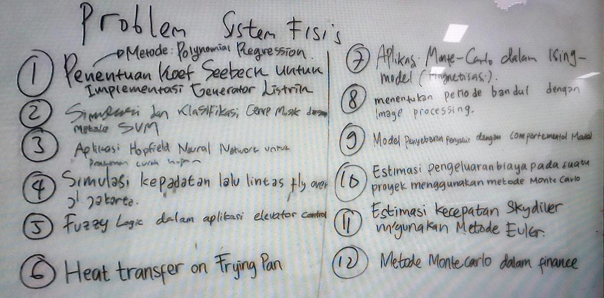

# topik-topik sistem fisis

## problem sistem fisis\*
1. Penentuan koefisien Seebeck dengan metode polynomial regression untuk implementasi generator listrik.
2. Simulasi dan klasifikasi gempa bumi dengan metode SVM.
3. Aplikasi Hopfield neural network untuk prakiraan curah hujan.
4. Simulasi kepadatan lalu lintas fly over jalan Jakarta.
5. Fuzzy logic dalam aplikasi elevator control.
6. Heat transfer on frying pan.
7. Aplikasi Monte Carlo dalam Ising model (magnetisasi).
8. Menentukan periode bandul dengan image processing.
9. Model penyebaran penyakit dengan compartemental model.
10. Estimasi pengeluaran biaya pada suatu proyek menggunakan metode Monte Carlo.
11. Estimasi kecepatan skydriver menggunakan metode Euler.
12. Metode Monte Carlo dalam finance.

\*Terdapat kemungkin salah penafsiran dari tulisan di whiteboard sebagaimana tertampilkan pada foto di atas.
